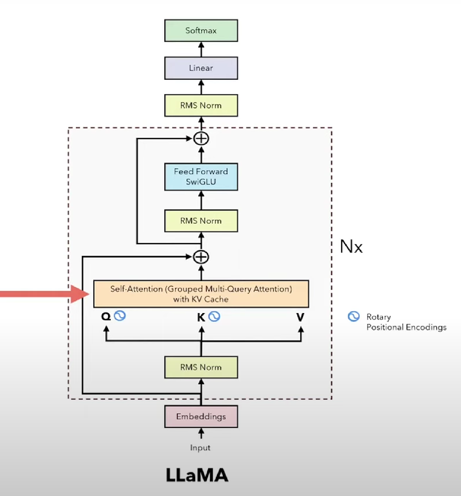
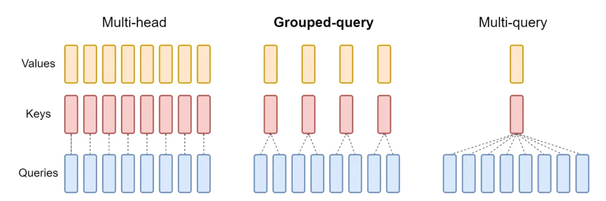

# LLaMA



- @dataclass 作Decorator 的作用

```python
@dataclass
class ModelArgs:
    dim: int = 4096
    n_layers: int = 32
    n_heads: int = 32
    n_kv_heads: Optional[int] = None
    # ...
```

这种写法等价于

```python
class ModelArgs(nn.Module):
    def __init__(self, dim: int = 4096, n_layers: int = 32, *args, **kwargs):
        super().__init__()
        self.dim = dim
        self.n_layers = n_layers
```

- RMSNorm的公式如下

$$
\bar{a}_ i=\frac{a_ i}{\mathbf{RMS}(\mathbf{a})}g_ i,\quad\text{where RMS}(\mathbf{a})=\sqrt{\frac{1}{n}\sum_ {i=1}^na_ i^2}
$$

```python
class RMSNorm(nn.Module):
    def __init__(self, dim: int, eps: float = 1e-6):
        super().__init__()
        self.eps = eps
        # The gamma parameter
        self.weight = nn.Parameter(torch.ones(dim))

    def _norm(self, x: torch.Tensor):
        # (batch, seq_len, dim) * (batch, seq_len, 1) = (batch, seq_len, dim)
        # rsqrt: 1 / sqrt(x) 
        return x * torch.rsqrt(x.pow(2).mean(-1, keepdim=True) + self.eps)
    
    def forward(self, x: torch.Tensor):
        # (dim) * (batch, seq_len, dim) = (batch, seq_len, dim)
        return self.weight * self._norm(x.float()).type_as(x)
```

- Grouped Multi-Query Self-Attention模块（添加了KVCache）



```python
# 首先要明白ModelArgs中的几个参数含义
@dataclass
class ModelArgs:
    n_heads: int = 32 # Query的heads数
    n_kv_heads: Optional[int] = None # Keys, Values的heads数
    # 如图所示，n_heads是n_kv_heads的整数倍
    max_batch_size: int = 32
    max_seq_len: int = 2048
```

```python
class SelfAttention(nn.Module):
    def __init__(self, args: ModelArgs):
        super().__init__()
        self.n_kv_heads = args.n_kv_heads if args.n_kv_heads is not None else args.n_heads
        self.n_q_heads = args.n_heads
        self.n_rep = self.n_q_heads // self.n_kv_heads # n_heads相较于n_kv_heads的倍数
        self.head_q_dim = args.dim // args.n_q_heads # Query每一个头的dimension
        self.heads_kv_dim = args.dim // args.n_kv_heads # Key, Value每一个头的dimension
        
        self.wq = nn.Linear(args.dim, self.n_q_heads*self.head_q_dim, bias=False)
        self.wk = nn.Linear(args.dim, self.n_kv_heads*self.head_kv_dim, bias=False)
        self.wv = nn.Linear(args.dim, self.n_kv_heads*self.head_kv_dim, bias=False)
        self.wo = nn.Linear(self.n_heads*self.head_dim, args.dim, bias=False)
        
        # KVCache的部分，首先要设置两个全0矩阵用来作为cache，那就需要全0矩阵的shape是理论上Key和Value能达到的最大的
        # 在NLP领域的多头注意力机制中，K, Q, V的shape是(batch_size, seq_len, n_heads, head_dim)
        self.cache_k = torch.zeros((args.max_batch_size, args.max_seq_len, self.n_kv_heads, self.head_dim))
        self.cache_v = torch.zeros((args.max_batch_size, args.max_seq_len, self.n_kv_heads, self.head_dim))
    
    def forward(self, x: torch.Tensor, start_pos: int, freq_complex: torch.Tensor):
        # 输入的x的shape是(batch_size, seq_len, dim)
        batch_size, seq_len, _ = x.shape
        
        xq = self.wq(x) # (batch_size, seq_len=1, dim) -> (batch_size, seq_len=1, n_q_heads * head_q_dim)
        xk = self.wk(x) # (batch_size, seq_len=1, dim) -> (batch_size, seq_len=1, n_kv_heads * head_kv_dim)
        xv = self.wv(x) # (batch_size, seq_len=1, dim) -> (batch_size, seq_len=1, n_kv_heads * head_kv_dim)
		
        xq = xq.view(batch_size, seq_len, self.n_q_heads, self.head_q_dim)
        xk = xk.view(batch_size, seq_len, self.n_kv_heads, self.head_kv_dim)
        xv = xv.view(batch_size, seq_len, self.n_kv_heads, self.head_kv_dim)
        
        # 旋转位置编码需要在query和key上添加，添加旋转位置编码不会改变张量的shape
        xq = apply_rotary_embeddings(xq, freq_complex, device=x.device)
        xk = apply_rotary_embeddings(xk, freq_complex, device=x.device)
        
        self.cache_k[:batch_size, start_pos:start_pos+seq_len] = xk
        self.cache_v[:batch_size, start_pos:start_pos+seq_len] = xv
        
        keys = self.cache_k[:batch_size, :start_pos+seq_len]
        values = self.cache_v[:batch_size, :start_pos+seq_len]
        
        # 根据之前的self.n_rep参数来 repeat the heads of the K and V to reach the number of heads of the Q
        keys = repeat(keys, self.n_rep)
        values = repeat(values, self.n_rep)
        
        # 要执行attention操作时，首先要将shape transpose成为(batch_size, n_heads, seq_len, head_dim)
        xq = xq.transpose(1, 2)
        keys = keys.transpose(1, 2)
        values = values.transpse(1, 2)
        
        # (batch_size, n_heads, seq_len, head_dim) @ (batch_size, n_heads, head_dim, seq_len_kv) -> (batch_size, n_heads, seq_len, seq_len_kv)
        scores = torch.matmul(xq, keys.transpose(2, 3)) / math.sqrt(self.head_dim)
        scores = F.softmax(scores.float(), dim=-1).type_as(xq)
        
        # (batch_size, n_heads, seq_len, seq_len_kv) @ (batch_size, n_heads, seq_len_kv, head_dim)
        outs = torch.matmul(scores, values)
        outs = outs.transpose(1, 2).contiguous().view(batch_size, seq_len, -1)
        output = self.wo(outs)
        return output
        
```

- Precompute_theta_pos_frequencies函数

$$
\begin{pmatrix}q_0\\q_1\\q_2\\q_3\\\vdots\\q_{d-2}\\q_{d-1}\end{pmatrix}\otimes\begin{pmatrix}\cos m\theta_0\\\cos m\theta_0\\\cos m\theta_1\\\cos m\theta_1\\\vdots\\\cos m\theta_{d/2-1}\\\cos m\theta_{d/2-1}\end{pmatrix}+\begin{pmatrix}-q_1\\q_0\\-q_3\\q_2\\\vdots\\-q_{d-1}\\q_{d-2}\end{pmatrix}\otimes\begin{pmatrix}\sin m\theta_0\\\sin m\theta_0\\\sin m\theta_1\\\sin m\theta_1\\\vdots\\\sin m\theta_{d/2-1}\\\sin m\theta_{d/2-1}\end{pmatrix}
$$

$$
\theta_j=10000^{-2(j-1)/d},j\in[1,2,\ldots,d/2]
$$

```python
def precompute_theta_pos_frequencies(head_dim: int, seq_len: int, device: str, theta: float = 10000.0)
	assert head_dim % 2 == 0, "Dimension must be divisible by 2"
    # theta_j = 10000 ^ (-2(j-1)/dim) for j = [1, 2, ..., dim/2]
    theta_numerator = torch.arange(0, head_dim, 2).float() # 2(j-1) for j = [1, 2, ..., dim/2]
    # Shape: (Head_dim / 2)
    theta = 1.0 / (theta ** (theta_numerator / head_dim)).to(device)
    # Construct the positions(the "m" parameter)
    # Shape: (Seq_len)
    m = torch.arange(seq_len, device=device)
    # Shape: (Seq_len) outer_proj (Head_dim / 2) -> (Seq_len, Head_dim / 2)
    freqs = torch.outer(m, theta).float()
    freqs_complex = torch.polar(torch.ones_like(freqs), freqs)
    return freqs_complex
```

### `torch.outer`函数用法

`torch.outer` 计算了两个张量 `a` 和 `b` 的外积，结果是一个新的张量，其形状为 `(len(a), len(b))`，并且其中的每个元素都是对应位置上 `a` 和 `b` 中元素的乘积。

```python
import torch

# 创建两个示例张量
a = torch.tensor([1, 2, 3])
b = torch.tensor([4, 5])

# 计算它们的外积
outer_product = torch.outer(a, b)

print(outer_product)

# 输出结果
tensor([[ 4,  5],
        [ 8, 10],
        [12, 15]])
```

### `torch.polar`函数用法

`torch.polar` 函数用于将复数表示从直角坐标形式转换为极坐标形式。在深度学习和信号处理领域中，这种转换通常用于处理频域信号和相位信息。具体来说，`torch.polar` 接受两个输入张量，一个包含实部，另一个包含虚部，然后返回一个张量，其中包含了对应极坐标形式的模值和幅度角度

```python
import torch

# 创建示例张量，其中包含复数的实部和虚部
real = torch.tensor([1.0, 0.0, -1.0])
imag = torch.tensor([0.0, 1.0, 0.0])

# 使用 torch.polar 将直角坐标形式转换为极坐标形式
magnitude, angle = torch.polar(real, imag)

print("Magnitude:", magnitude) # 复数模值
print("Angle (in radians):", angle) # 复数幅角

# 输出结果
Magnitude: tensor([1., 1., 1.])
Angle (in radians): tensor([0., 1.5708, 3.1416]) # ([0, pi/2, pi])
```

- Attention操作中的apply_rotary_embeddings函数

```python
def apply_rotary_embeddings(x: torch.Tensor, freqs_complex: torch.Tensor, device: str):
    # x.float().reshape(*x.shape[:-1], -1, 2): (batch, seq_len, h, head_dim) -> (batch, seq_len, h, head_dim / 2, 2)
    # torch.view_as_complex(): (batch, seq_len, h, head_dim / 2, 2) -> (batch, seq_len, h, head_dim / 2)
    x_complex = torch.view_as_complex(x.float().reshape(*x.shape[:-1], -1, 2))
    # (seq_len, head_dim / 2) -> (1, seq_len, 1, head_dim / 2)
    freqs_complex = freqs_complex.unsqueeze(0).unsqueeze(2)
    # (batch, seq_len, h, head_dim / 2) * (1, seq_len, 1, head_dim / 2) -> (batch, seq_len, h, head_dim / 2), 广播机制
    x_rotated = x_complex * freqs_complex
    # torch.view_as_real(): (batch, seq_len, h, head_dim / 2) -> (batch, seq_len, h, head_dim / 2, 2)
    x_out = torch.view_as_real(x_rotated)
    # (batch, seq_len, h, head_dim / 2, 2) -> (batch, seq_len, h, head_dim)
    x_out = x_out.reshape(*x.shape)
    return x_out.type_as(x).to(device)
```

### `torch.view_as_complex`函数用法

```python
import torch

real_part = torch.tensor([1.0, 2.0, 3.0])
imag_part = torch.tensor([0.0, 0.0, 0.0])

complex_tensor = torch.view_as_complex(torch.stack((real_part, imag_part), dim=-1))

print(complex_tensor)

# 输出结果
tensor([1.+0.j, 2.+0.j, 3.+0.j])
```

### `torch.view_as_real`函数用法

```python
import torch

complex_tensor = torch.tensor([1+2j, 3-4j, 5+6j], dtype=torch.complex64)

real_part = torch.view_as_real(complex_tensor)[:, 0]
imag_part = torch.view_as_real(complex_tensor)[:, 1]

print("Real Part:", real_part)
print("Imaginary Part:", imag_part)

# 输出结果
Real Part: tensor([1., 3., 5.])
Imaginary Part: tensor([ 2., -4.,  6.])
```

- repeat_kv函数

```python
def repeat_kv(x: torch.Tensor, n_rep: int) -> torch.Tensor:
    batch_size, seq_len, n_kv_heads, head_dim = x.shape
    if n_rep == 1:
        return x
    else:
        # x[:, :, :, None, :]：这一部分通过切片操作在 x 张量的维度之间插入一个新维度，使得现在张量的形状为 (batch_size, seq_len, n_kv_heads, 1, head_dim)。
        # .expand(batch_size, seq_len, n_kv_heads, n_rep, head_dim)：接着，使用 expand 函数将这个张量扩展为形状 (batch_size, seq_len, n_kv_heads, n_rep, head_dim)，此时实际上是将 x 中的 n_kv_heads 维度重复 n_rep 次。
        return (x[:, :, :, None, :].expand(batch_size, seq_len, n_kv_heads, n_rep, head_dim)
                .reshape(batch_size, seq_len, n_kv_heads * n_rep, head_dim))
```

- FeedForward模块使用的Activation Function是SwiGLU

$$
\text{Vanilla\; FFN:}\;w_ {2}*ReLU(w_ {1}x+b_ {1})+b_ {2}\\
swish(x) = x*sigmoid(\beta*x),\; if\;\beta=1,\,swish()\;\text{equal\; to}\; SiLU()\\
\text{Transformer\;FFN\;(using\;SwiGLU):}\;w_ {2}*(matmul(swish(w_ {1}*x),V*x))
$$

```python
@dataclass
class ModelArgs:
    ffn_dim_multiplier: Optional[float] = None
    multiple_of: int = 256

class FeedForward(nn.Module):
    def __init__(self, args: ModelArgs):
        super().__init__()
        
        hidden_dim = 4 * args.dim
        hidden_dim = int(2 * hidden_dim / 3)
        if args.ffn_dim_multiplier is not None:
            hidden_dim = int(args.ffn_dim_multiplier * hidden_dim)
        # Round the hidden_dim to the nearest multiple of the multiple_of parameter
        hidden_dim = arg.multiple_of * ((hidden_dim + arg.multiple_of - 1) // args.multiple_of)
        
        self.w1 = nn.Linear(args.dim, hidden_dim, bias=False)
        self.w2 = nn.Linear(hidden_dim, args.dim, bias=False)
        self.w3 = nn.Linear(args.dim, hidden_dim, bias=False)
        
    def forward(self, x: torch.Tensor):
        swish = F.silu(self.w1(x))
       	x_V = self.w3(x)
        output = self.w2(swish * x_V)
        
        return output
        
```

- 搭EncoderBlock的积木

```python
@dataclass
class ModelArgs:
    dim: int = 4096
	norm_eps: float = 1e-5
        
class EncoderBlock(nn.Module):
    def __init__(self, args: ModelArgs):
        super().__init__()
        self.n_heads = args.n_heads
        self.dim = args.dim
        self.head_dim = args.dim // args.n_heads
        
        self.attention = SelfAttention(args)
        self.feed_forward = FeedForward(args)
        
        # Normalization before the self-attention
        self.attention_norm = RMSNorm(args.dim, eps=args.norm_eps)
        self.ffn_norm = RMSNorm(args.dim, eps=args.norm_eps)
        
    def forward(self, x: torch.Tensor, start_pos: int, freqs_complex: torch.Tensor):
        h = x + self.attention.forward(self.attention_norm(x), start_pos, freqs_complex)
        output = h + self.feed_forward.forward(self.ffn_norm(h))
        
        return output
        
```

- 搭Transformer的积木

```python
@dataclass
class ModelArgs:
    dim: int = 4096
    n_layers: int = 32
    n_heads: int = 32
    n_kv_heads: Optional[int] = None
    vocab_size: int = -1 # This will be set when we load the tokenizer
    multiple_of: int = 256
    ffn_dim_multiplier: Optional[float] = None
    norm_eps: float = 1e-5

    # Needed for KV cache
    max_batch_size: int = 32
    max_seq_len: int = 2048

    device: str = None

class Transformer(nn.Module):
    def __init__(self, args: ModelArgs):
        super().__init__()
        
        assert args.vocab_size != -1, "Vocab size must be set"
        
        self.vocab_size = args.vocab_size
        self.n_layers = args.n_layers
        self.token_embeddings = nn.Embedding(self.vocab_size, args.dim)
        
        self.layers = nn.ModuleList()
        for _ in range(args.n_layers):
            self.n_layers.append(EncoderBlock(args))
        
        self.norm = RMSNorm(args.dim, eps=args.norm_eps)
        self.output = nn.Linear(args.dim, self.vocab_size, bias=False)
        
        self.freqs_complex = precompute_theta_pos_frequencies(args.dim // args.n_heads, args.max_seq_len*2, device=args.device)
        
    def forward(self, tokens: torch.Tensor, start_pos: int):
        _, seq_len = tokens.shape
        # 每个时间步只处理一个token
        assert seq_len == 1, "Only one token at a time can be processed"
        
        # (batch_size, seq_len) -> (batch_size, seq_len, dim)
        h = self.token_embedding(tokens)
        
        # Retrieve the pairs (m, theta) corresponding to the positions [start_pos, start_pos + seq_len]
        freqs_complex = self.freqs_complex[start_pos:start_pos + seq_len]
        
        for layer in self.layers:
            h = layer(h, start_pos, freqs_complex)
        h = self.norm(h)
        output = self.output(h).float()
        
        return output
        
        
```


