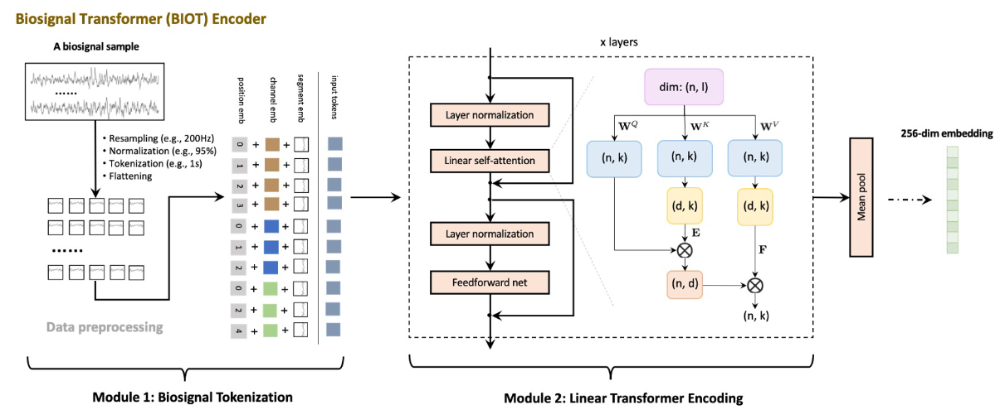
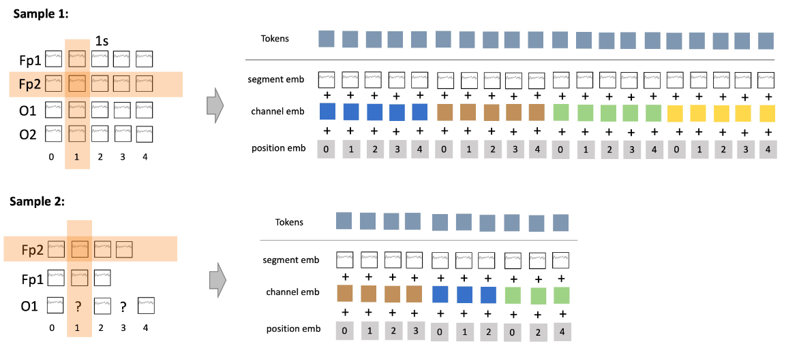
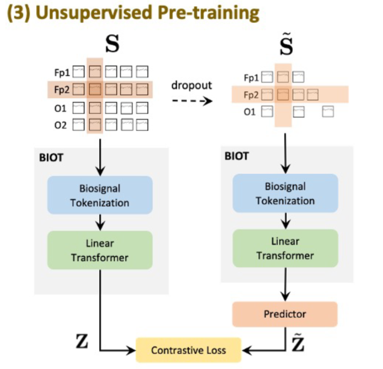

# BIOT: Cross-data Biosignal Learning in the Wild

## Abstract

**本文借鉴了LLM中文本信息处理过程方法，用Transformer结构编码生物信号，试图解决现有的用于生物信号的深度学习模型，通常是专门针对特定数据集和临床环境进行优化的结构，广泛适用性受到限制的问题。**

- 生物信号在预处理中会遇到什么问题
  1. 信号通道不匹配（in_channels数目不一致）
  2. 样本长度不一致（seq_len不一致）
  3. 信号数据普遍具有缺失值

## Introduction

- 现有的使用DL方法进行生物信号分析的几个方向
  1. 在原始数据上使用Conv1d来编码信息
  2. 先使用短时傅里叶变换(STFT)等方法得到信号的频谱图，再使用Conv2d在频谱图上进行信号处理
  3. 分割原始信号，使用如CNN、RNN、Transformer等网络结构作为编码器捕捉时间特性
  4. 使用多个编码器来编码信号的时间、空间维度特征，进行特征融合

上述方法都是在特定任务下使用固定格式的生物信号样本来进行的，但是对于在生物信号预处理的难题上，以及如何学习到大量的无标注数据的潜在特征也是至关重要的

但是如果在数据的预处理过程中，使用截断或填充信号来获得一致的长度，或者填补缺失的通道和片段，会引入非必要的噪声以及数据分布偏移，从而导致模型泛化性能变差，所以本文提出了一种灵活且统一的模型，以适应具有多种格式的生物信号

- 本文贡献
  1. 提出biosignal tokenization module，用tokenizer的方式将不同长度的生物信号编码成统一的sentence
  2. 统一的范式，使得模型可以实现在不同生物信号数据集之间的联合（预）训练和知识传递，这启发了基于生物信号的大型基础模型的研究。
  3. 实证性能较好，BIOT在性能上优于基准模型，并且可以利用在其他数据上预训练的模型来有益于当前的任务（不SOTA，但Work）。

## Methods

1. **Resampling**，先使用线性插值，将所有的数据重采样到相同的频率（如200Hz），因为EEG和ECG信号，通常**感兴趣的**（什么是感兴趣的）最高频率约为100赫兹，因此根据奈奎斯特-香农采样定理，对于典型的EEG或ECG应用，200赫兹或250赫兹可能是合适的采样频率。
2. **Normalization**，使用绝对振幅的95%分位数来对每个通道进行归一化，以缓解不同通道和数据集之间的单位差异和幅度不匹配问题，具体步骤如下
   1. 首先，对于给定的数据集或信号通道，计算每个数据点的绝对值，这会将所有数值转化为正数，忽略了正负号。
   2. 接下来，找到这些绝对值的95%分位数。这意味着将数据按从小到大的顺序排列，然后找到排在第95%位置的值，也就是数据中的绝对振幅值，其中95%的数据点的绝对值小于这个值。
   3. 使用这个95%分位数的值作为标准来进行归一化。具体而言，将每个数据点除以这个95%分位数的值，以确保大部分数据点都在0到1之间。

3. **Tokenization**，信号长度为 $J$ ，token长度为 $t$ ，token的重叠部分长度为 $p$ ，则 $k\text{-th}\ (k=1,2,3,\ldots)$ ，且在 $i\text{-th}$ channel的token可以表示为 $\text{ S}[i,(t-p)(k-1):(t-p)(k-1)+t]$ ，其中 $(t-p)(k-1)+t\leq J$ ，如果存在缺失值，直接舍弃掉相应的tokenization
4. **Flattening**，最后将来自所有通道的tokens，flatten成一个一致的 "sentence"

上图中的橙色区域是有是空间关联的

- 三种Embedding策略，来丰富token的信息
  1. **Segment Embedding** ，先从频谱角度获取每一个token的energy vector（通过FFT的方法），在应用全连接网络得到
  2. **Channel Embedding (spatial)**，根据不同的通道得到一个Embedding表
  3. **Positional Embedding (temporal)**，使用正余弦函数，得到相对位置编码

- 如果一个EEG信号，有64个通道，信号长度为20 seconds，那么转换成token后的长度就是1280，所以要使用线性注意力机制来取代原有的平方注意力机制

  经过tokenize之后得到的sentence为 $\mathbf{X}\in\mathbb{R}^{N\times l}$ ， $N$  是token的数量， $l$  是token的维度。 $\mathbf{W}^K,\mathbf{W}^V,\mathbf{W}^Q\in\mathbb{R}^{l\times k}$ ，降维的参数矩阵 $\mathbf{E}^{\top}\in\mathbb{R}^{N\times d},\mathbf{F}\in\mathbb{R}^{d\times N}\text{ (where }d\ll N)$ ，所以输出 $\mathbf{H}\in\mathbb{R}^{N\times k}$ ，满足

  

$$
\mathbf{H}=\text{Attention}(\mathbf{X}\mathbf{W}^Q,\mathbf{E}\mathbf{X}\mathbf{W}^K,\mathbf{F}\mathbf{X}\mathbf{W}^V)={\text{softmax}\left(\frac{(\mathbf{X}\mathbf{W}^Q)(\mathbf{E}\mathbf{X}\mathbf{W}^K)^\top}{\sqrt k}\right)}\cdot{\mathbf{F}\mathbf{X}\mathbf{W}^V}
$$

- 无监督任务是怎么做的（原图不是矢量图，截起来很糊）

假设 $\mathbf{S}$ 是原始信号，我们随机dropout其中一部分通道并从剩余通道中丢弃一部分token，得到干扰信号 $\tilde{\mathbf{S}}$ ，然后我们使用相同的 $\text{BIOT}$ 编码器获取 $\mathbf{S}$ 和 $\tilde{\mathbf{S}}$ 的Embedding vector，为了构建目标，我们希望通过扰动信号来预测原始信号的嵌入。因此，我们在扰动信号后附加了一个额外的预测器（即两层神经网络）。我们使用 $\mathbf{Z}$ 和 $\tilde{\mathbf{Z}}$ 来表示 $\mathbf{S}$ 的真实嵌入和从 $\tilde{\mathbf{S}}$ 预测的嵌入

$$
\mathbf{Z}=\text{ BIOT}(\mathbf{S}),\:\tilde{\mathbf{Z}}=\mathrm{~predictor}(\text{BIOT}(\tilde{\mathbf{S}})).
$$

对比损失函数为

$$
\mathcal{L}=\mathrm{~Cross}\mathrm{EntropyLoss}\left(\mathrm{softmax}\left(\langle\mathbf{Z},\tilde{\mathbf{Z}}^{\top}\rangle/T\right),\mathbf{I}\right).
$$

$T$ 是temperature（在本文中 $T=0.2$ ）， $\mathbf{I}$ 是identity matrix（主对角线元素为1，其余位置元素为0的矩阵）。在实验中，对 $\mathbf{Z}$ 和 $\tilde{\mathbf{Z}}$ 在 softmax 操作之前做了 L2-norm 归一化

## Experiments

本文在两个大型脑电图语料库（每个500万样本）上进行了广泛的无监督预训练评估，并在多个脑电图、心电图、人体行动感知数据集上进行了监督学习评估