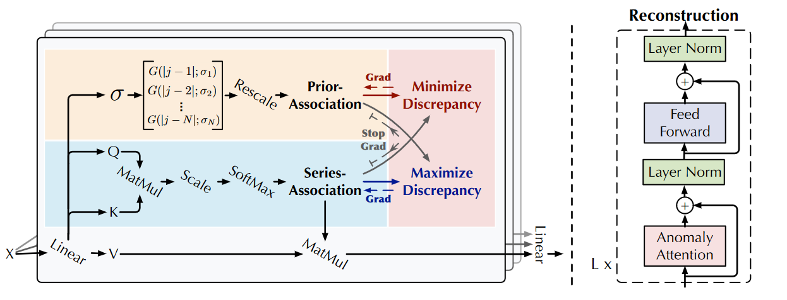
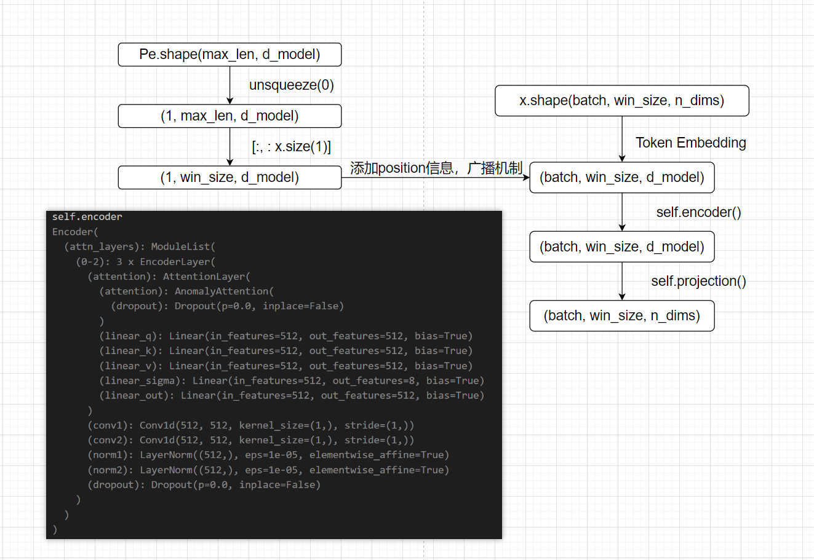
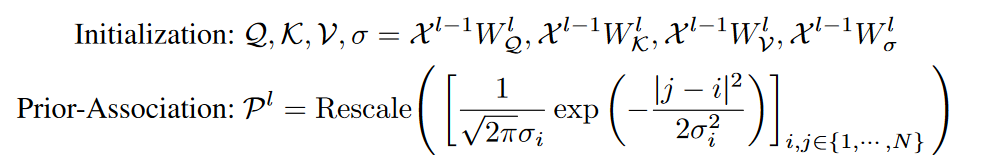

# Anomaly Transformer代码模块精讲

**本文将从以下几个方面来讲解 Anomaly Transformer的代码**

1. Dataloader过程怎么写的？输入到网络中的原始数据shape是什么？
2. 网络模块是如何搭建的（画思维导图）？
3. 对于无监督学习而言，正负样本对的构建形式是怎么样的？
4. 无监督学习的目标损失函数是什么？
5. 网络的性能评价指标是什么？

---

- Dataloader过程，输入到网络中的原始数据shape

```python
from sklearn.preprocessing import StandardScaler

class PSMSegLoader(Dataset):
    def __init__(self, data_path, win_size, step, mode="train"):
        self.mode = mode
        self.step = step
        self.win_size = win_size
        self.scaler = StandardScaler()
        data = pd.read_csv(data_path + '/train.csv')
        data = data.values[:, 1:] # (num_data, dim), dim=25

        data = np.nan_to_num(data) # 将数据中的缺失值替换成0
		
        self.scaler.fit(data) # 计算data的均值和方差，在transform之前必须进行的部分
        data = self.scaler.transform(data) # 将数据缩放到均值为0、方差为1的标准正态分布
```

```python
def __getitem__(self, index):
        index = index * self.step
        if self.mode == "train":
            return np.float32(self.train[index:index + self.win_size]), np.float32(self.test_labels[0:self.win_size])
        elif (self.mode == 'val'):
            return np.float32(self.val[index:index + self.win_size]), np.float32(self.test_labels[0:self.win_size])
        elif (self.mode == 'test'):
            return np.float32(self.test[index:index + self.win_size]), np.float32(
                self.test_labels[index:index + self.win_size])
        else:
            return np.float32(self.test[
                              index // self.step * self.win_size:index // self.step * self.win_size + self.win_size]), np.float32(
                self.test_labels[index // self.step * self.win_size:index // self.step * self.win_size + self.win_size])
```

导入了来自 `sklearn` 库的 `StandardScaler` 类，用于数据标准化。根据`__getitem__`函数，可以看到返回的数据是numpy格式，shape为(win_size, dim)，即(100, 25)，即输入到网络中的原始数据shape为(batch, win_size, dim)

- 网络模块是如何搭建的





```python
class AnomalyTransformer(nn.Module):
    def __init__(self, win_size, in_channels, out_channels, mask_flag=False, d_model=512, n_heads=8, e_layers=3, d_ff=512,
                 dropout=0.0, activation='gelu', output_attention=True):
        super().__init__()
        self.output_attention = output_attention
        self.embedding = DataEmbedding(in_channels, d_model, dropout)
        self.encoder = Encoder([
            EncoderLayer(
                AttentionLayer(
                    AnomalyAttention(win_size,  mask_flag, attention_dropout=dropout, output_attention=output_attention), d_model, n_heads
                ), d_model, d_ff, dropout, activation
            ) for _ in range(e_layers)
        ])
        self.projection = nn.Linear(d_model, out_channels)

    def forward(self, x):
        encoding = self.embedding(x)
        enc_out, attn, prior, sigma = self.encoder(encoding)
        enc_out = self.projection(enc_out)

        if self.output_attention:
            return enc_out, attn, prior, sigma
        else:
            return enc_out
```

- 损失函数

```python
def my_kl_loss(p, q):
    res = p * (torch.log(p + 0.0001) - torch.log(q + 0.0001))
    return torch.mean(torch.sum(res, dim=-1), dim=1)

# calculate Association discrepancy
series_loss = 0.0
prior_loss = 0.0
for u in range(len(prior)):
    series_loss += (torch.mean(my_kl_loss(series[u], (prior[u] / torch.unsqueeze(torch.sum(prior[u], dim=-1), dim=-1).repeat(1, 1, 1,self.win_size)).detach())) + 
                    torch.mean(my_kl_loss((prior[u] / torch.unsqueeze(torch.sum(prior[u], dim=-1), dim=-1).repeat(1, 1, 1, self.win_size)).detach(), series[u])))
    prior_loss += (torch.mean(my_kl_loss((prior[u] / torch.unsqueeze(torch.sum(prior[u], dim=-1), dim=-1).repeat(1, 1, 1,self.win_size)),series[u].detach())) + 
                    torch.mean(my_kl_loss(series[u].detach(), (prior[u] / torch.unsqueeze(torch.sum(prior[u], dim=-1), dim=-1).repeat(1, 1, 1, self.win_size)))))
series_loss = series_loss / len(prior)
prior_loss = prior_loss / len(prior)

rec_loss = self.criterion(output, input)

loss1_list.append((rec_loss - self.k * series_loss).item())
loss1 = rec_loss - self.k * series_loss
loss2 = rec_loss + self.k * prior_loss
```

- prior是什么（本文改进点，可学习的高斯核）



```python
self.linear_sigma = nn.Linear(d_model, n_heads)

sigma = self.linear_sigma(queries).view(batch_size, win_size, self.n_heads)

sigma = sigma.transpose(1, 2) # (batch_size, seq_len, heads) -> (batch_size, heads, seq_len)
        window_size = attn_score.shape[-1]
        sigma = torch.sigmoid(sigma * 5) + 1e-5
        sigma = torch.pow(3, sigma) - 1 # (batch_size, heads, seq_len)
        sigma = sigma.unsqueeze(-1).repeat(1, 1, 1, window_size) # (batch_size, heads, seq_len, seq_len), 前三个维度不变，只在最后一个维度上重复seq_len次
        prior = self.distance.unsqueeze(0).unsqueeze(0).repeat(sigma.shape[0], sigma.shape[1], 1, 1).cuda() # (batch_size, heads, seq_len, seq_len)
        prior = 1.0 / (math.sqrt(2 * math.pi) * sigma) * torch.exp(-prior ** 2 / 2 / (sigma ** 2))
```

- 本文如何定义检测到异常？网络的性能评价指标是什么？

如果在某个连续的异常段中检测到一个时间点，则认为该异常段中的所有异常都被正确检测到。这个策略是合理的，因为观察表明，在实际应用中，异常时间点会引发警报，进一步使整个段被注意到。

评价指标是accuracy, precision, recall, f_score

```python
anomaly_state = False
for i in range(len(gt)):
    if gt[i] == 1 and pred[i] == 1 and not anomaly_state:
        anomaly_state = True
        for j in range(i, 0, -1):
            if gt[j] == 0:
                break
            else:
                if pred[j] == 0:
                    pred[j] = 1
        for j in range(i, len(gt)):
            if gt[j] == 0:
                break
            else:
                if pred[j] == 0:
                    pred[j] = 1
    elif gt[i] == 0:
        anomaly_state = False
    if anomaly_state:
        pred[i] = 1

pred = np.array(pred)
gt = np.array(gt)
print("pred: ", pred.shape)
print("gt:   ", gt.shape)

from sklearn.metrics import precision_recall_fscore_support
from sklearn.metrics import accuracy_score
accuracy = accuracy_score(gt, pred)
precision, recall, f_score, support = precision_recall_fscore_support(gt, pred,
                                                                        average='binary')
print(
    "Accuracy : {:0.4f}, Precision : {:0.4f}, Recall : {:0.4f}, F-score : {:0.4f} ".format(
        accuracy, precision,
        recall, f_score))

return accuracy, precision, recall, f_score

```

