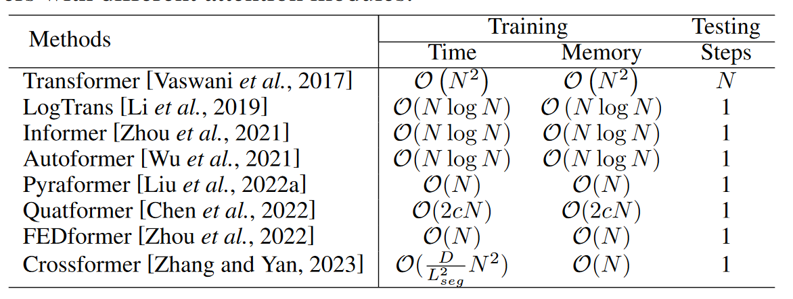
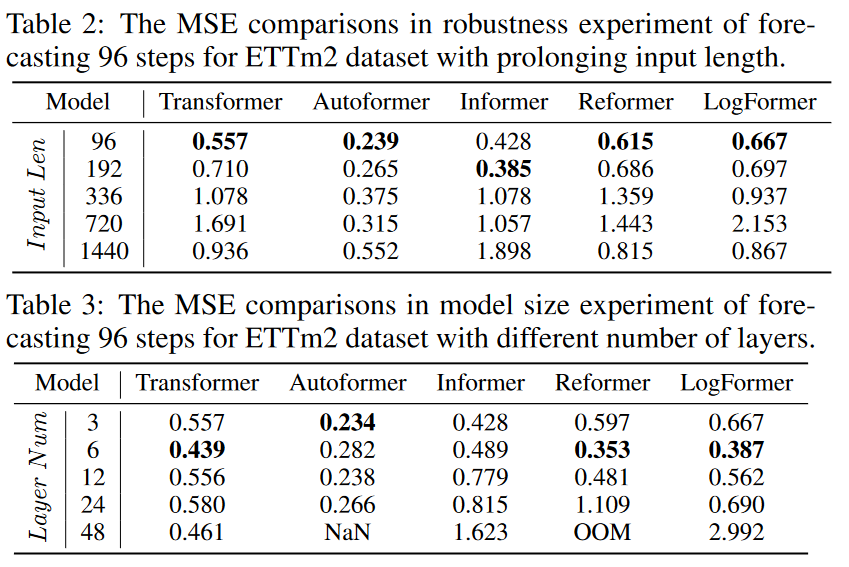

# Transformers in Time Series: A Survey

本文是对时间序列内应用Transformer模型的综述，从修改网络结构和使用场景不同这两个维度来介绍论文。对一些模型进行了鲁棒性分析、模型大小分析和季节趋势分解分析

季节性或周期性是时间序列的一个重要特征。如何有效地建模长期和短期的时间依赖关系，并同时捕捉季节性，仍然存在挑战

## Network Modifications for Time Series

### Positional Encoding

由于时间序列的顺序很重要，将输入时间序列的位置编码到Transformers中非常关键。一种常见的方法是首先将位置信息编码为向量，然后将它们与输入的时间序列一起作为输入，喂入模型中

在使用Transformers建模时间序列时，如何获取这些向量主要可以分为三个类别

1. **Vanilla Positional Encoding**

传统的位置编码尽管可以给予一定的位置信息，但是它无法充分利用到时序数据的内在特性

2. **Learnable Positional Encoding**

传统的位置编码是人为设定的，这就导致了附加信息少，且在一些场景中是不适配的，所以如果能从时序数据中学习到适当的位置嵌入表示，可能会更有效，学习到的嵌入表示信息更加灵活

3. **Timestamp Encoding**

在现实场景中建模时序信息时，信息中通常包含时间戳，这些时间戳可以通过可学习的嵌入层编码为额外的位置向量，来提供给模型丰富的位置信息

### Attention Module

传统Transformer中的自注意力模块具有O(N^2)（N为输入时间序列长度）的时间和内存复杂度，当处理长序列时，这成为计算的瓶颈

后续工作提出许多高效的transformer模型来降低平方复杂度，主要可以分为两个类别

1. 显式地引入稀疏偏差(sparsity bias)到注意力机制中，比如LongTrans, Pyraformer等
2. 利用自注意力矩阵的低秩特性来加速运算

下表展示了一些常见的应用于时间序列建模的Transformer结构的时间复杂度和空间复杂度

### Architecture-based Attention Innovation

最近的一些研究在架构级别对Transformer进行改进，尝试引入分层结构到Transformer中，以匹配时间序列的多分辨率特性，比如Informer就在注意力块之间插入了stride为2的max pooling层，来讲时间序列下采样为之前的一半，Pyraformer设计了基于C-ary树的注意力机制，其中最精细尺度的节点对应于原始时间序列，而较粗尺度的节点代表较低分辨率的序列。Pyraformer开发了既在尺度内部又在尺度间的注意力，以更好地捕捉不同分辨率之间的时间依赖性

## Applications of Time Series Transformers

### Transformers in Forecasting

使用稀疏归纳偏置或低秩近似来消除噪声并实现低阶计算复杂度

- LogTrans [Li等，2019]提出了卷积自注意力，通过使用因果卷积生成自注意力层中的查询和键。它引入了稀疏偏差，即Logsparse掩码，用于减少自注意力模型的计算复杂性，从O(N^2)降低到O(N log N)。
- Informer [Zhou等，2021]则根据查询和键的相似性选择主要查询，因此在计算复杂性方面取得了与LogTrans相似的改进。它还设计了一个生成式的解码器，用于直接进行长期预测，从而避免了在长期预测中使用单一前向步骤预测时的累积误差。
- AST [Wu等，2020a]使用生成对抗编码器-解码器框架来训练稀疏Transformer模型进行时间序列预测。它显示通过直接塑造网络的输出分布来避免通过一步推理积累误差，可以改善时间序列预测。
- Pyraformer [Liu等，2022a]设计了一个分层金字塔形注意力模块，具有二叉树沿着路径的线性时间和内存复杂性，用于捕获不同范围的时间依赖性。
- FEDformer [Zhou等，2022]在频域中应用了注意力操作，利用傅立叶变换和小波变换。它通过随机选择一个固定大小的频率子集来实现线性复杂性。值得注意的是，由于Autoformer和FEDformer的成功，社区开始更多关注在频域中探索自注意力机制，用于时间序列建模。
- Quatformer [Chen等，2022]提出了基于四元数的学习-旋转注意力（LRA），引入可学习的周期和相位信息来描述复杂的周期模式。此外，它使用全局内存来解耦LRA，以实现线性复杂性。

以下三项工作侧重于构建模型的显式解释能力，这符合可解释人工智能（XAI）的趋势。

- TFT [Lim等，2021]设计了一个具有静态协变量编码器、门控特征选择和时间自注意解码器的多视角预测模型。它从各种协变量中编码和选择有用信息来进行预测。它还通过整合全局、时间依赖性和事件来保持可解释性。
- ProTran [Tang和Matteson，2021]和SSDNet [Lin等，2021]将Transformer与状态空间模型结合起来提供概率性预测。ProTran设计了一个基于变分推断的生成建模和推理过程。SSDNet首先使用Transformer学习时间模式并估计SSM的参数，然后应用SSM执行季节趋势分解并保持可解释性能力。

模块级别的Transformer变种的第二种类型是规范化时间序列数据的方法。非平稳Transformer [Liu等，2022b]是唯一一项主要关注修改规范化机制的工作，如图2所示。它探讨了时间序列预测任务中的过度平稳化问题，使用相对简单的插件序列平稳和去平稳模块来修改和提高各种注意力块的性能。

模块级别Transformer的第三种变种类型是利用token输入的bias。

- Autoformer [Wu等，2021]采用基于分割的表示机制。它设计了一个简单的季节趋势分解架构，其中自相关机制充当注意力模块。自相关块测量输入信号的时间延迟相似性，并聚合前k个相似子系列以产生具有降低复杂性的输出。
- PatchTST [Nie等，2023]利用通道无关性，其中每个通道包含一个单变量时间序列，这些序列在所有系列中共享相同的嵌入，以及子系列级别的分段设计，将时间序列分割成子系列级别的块，这些块作为输入token传递给Transformer。这种ViT [Dosovitskiy等，2021]式的设计在长时间序列预测任务中大大提高了其数值性能。
- Crossformer [Zhang和Yan，2023]提出了一种基于Transformer的模型，用于多元时间序列预测，利用跨维度依赖性。输入被嵌入到2D矢量数组中，通过新颖的维度分段嵌入以保留时间和维度信息。然后，使用两阶段注意层来高效捕捉跨时间和跨维度的依赖性

架构级别的变种一些工作开始设计超出基本Transformer范围的新Transformer架构。

- Triformer [Cirstea等，2022]设计了一个具有三角形、变量特定的块注意力的模型。它具有三角形的树状结构，因为后续输入尺寸呈指数级收缩，并具有一组变量特定的参数，使多层Triformer保持轻量级和线性复杂性。
- Scaleformer [Shabani等，2023]提出了一个多尺度框架，可应用于基线的Transformer模型，用于时间序列预测（如FEDformer[Zhou等，2022]、Autoformer[Wu等，2021]等）。它通过迭代地在多个尺度上细化具有共享权重的预测时间序列，可以提高基线模型的性能。

### Transformers in Anomaly Detection

基于Transformer的架构还有助于时间序列异常检测任务，因为它具备建模时间依赖性的能力，提高了检测质量[Xu等，2022]。此外，在多个研究中，包括TranAD[Tuli等，2022]，MT-RVAE[Wang等，2022]和TransAnomaly[Zhang等，2021]，研究人员提出将Transformer与神经生成模型（例如VAEs[Kingma和Welling，2014]和GANs[Goodfellow等，2014]）相结合，以获得更好的异常检测性能。我们将在接下来的部分详细说明这些模型。

- TranAD[Tuli等，2022]提出了一种对抗训练过程，通过放大重建错误，因为简单的基于Transformer的网络往往会忽略异常的微小偏差。采用了GAN风格的对抗训练过程，由两个Transformer编码器和两个Transformer解码器设计，以获得稳定性。消融研究表明，如果替换基于Transformer的编码-解码器，F1得分会下降近11%，表明Transformer架构对时间序列异常检测产生了影响。

- MT-RVAE[Wang等，2022]和TransAnomaly[Zhang等，2021]将VAE与Transformer结合使用，但它们具有不同的目的。TransAnomaly将VAE与Transformer结合，以实现更多的并行化并减少近80%的训练成本。在MT-RVAE中，设计了一个多尺度Transformer，用于提取和整合不同尺度的时间序列信息。它克服了传统Transformer的不足之处，传统Transformer只能提取顺序分析的局部信息。

- GTA[Chen等，2021c]将Transformer与基于图的学习架构相结合，用于多元时间序列异常检测。值得注意的是，MT-RVAE也用于多元时间序列，但是在序列之间具有较少的维度或关系不够紧密的情况下，图神经网络模型效果不佳。为了解决这一挑战，MT-RVAE修改了位置编码模块并引入了特征学习模块。相比之下，GTA包含一个图卷积结构，用于建模影响传播过程。与MT-RVAE类似，GTA还考虑了“全局”信息，但通过使用多分支关注机制来替代传统的多头注意力，即全局学习的注意力、传统的多头注意力和邻域卷积的组合。

- AnomalyTrans[Xu等，2022]将Transformer和高斯先验关联起来，使异常更易识别。与TranAD有相似的动机，AnomalyTrans以不同的方式实现了这一目标。其观点是，与正常情况相比，异常更难与整个序列建立强烈的关联，但与相邻的时间点相比更容易。在AnomalyTrans中，先验关联和序列关联同时建模。除了重建损失外，异常模型通过极小极大策略进行优化，以限制先验关联和序列关联，使其具有更明显的关联差异。

### Transformers in Classification

Transformer被证明在各种时间序列分类任务中非常有效，因为它具有捕获长期依赖关系的杰出能力。GTN [Liu等，2021]使用两个Tower Transformer，其中每个Tower分别用于时间步骤级的注意力和通道级的注意力。为了合并两个Tower的特征，使用了可学习的加权串联（也称为“gating”）。所提出的Transformer扩展在13个多元时间序列分类任务中实现了最新的结果。

- [Rußwurm和K ̈ orner，2020]研究了基于自注意力的Transformer用于原始光学卫星时间序列分类，并与循环神经网络和卷积神经网络相比获得了最佳结果。

- TARNet [Chowdhury等，2022]设计了Transformer来学习任务感知的数据重建，从而增强了分类性能，该方法利用了关键时间戳掩码和重建的注意分数，实现了卓越的性能。

- 在分类任务中还研究了预训练的Transformers。[Yuan和Lin，2020]研究了用于原始光学卫星图像时间序列分类的Transformer。由于标记数据有限，作者使用了自监督的预训练模式。

- [Zerveas等，2021]引入了一个无监督的预训练框架，模型经过按比例掩码的数据进行预训练。然后，在下游任务中对预训练模型进行微调，如分类任务。

- [杨等，2021]提出使用大规模预训练的语音处理模型来解决下游时间序列分类问题，获得了30个流行的时间序列分类数据集中的19个竞争性结果。

## Experimental Evaluation and Discussion

Benchmark数据集：ETTm2

### Robustness Analysis

前面描述的很多工作都针对不同任务来定制化设计注意力模块，来达到良好效果或降低计算复杂度和内存开销，但是很多工作在其文献中，实际上都是使用了一个较短的固定大小的输入来达到最佳效果，本文对这些设计提出质疑，并进行鲁棒性的实验：延长输入序列长度，以验证它们在处理较长输入序列时的预测能力和稳健性

### Model Size Analysis

Transformer在这些领域的关键优势之一是可以通过增加模型大小来提高预测能力。通常，模型大小是根据Transformer的层数控制，通常设置在3至12层之间。然而，正如在表3的实验中所示，当我们比较具有不同层数的不同Transformer模型的预测结果时，通常具有3到6层的Transformer获得了更好的结果。这引发了一个问题，即如何设计一个具有更深层次的适当的Transformer架构，以增加模型的容量并实现更好的预测性能。

### Seasonal-Trend Decomposition Analysis

在最近的研究中，研究人员开始意识到**季节趋势分解**是Transformer在时间序列预测中影响性能指标的关键部分。正如表4中的实验所示，本文采用了[Wu等，2021]中提出的简单移动平均季节趋势分解架构来测试各种注意力模块。可以看到，简单的季节趋势分解模型可以显著提升模型的性能，提高了50%到80%。这是一个独特的模块，通过季节趋势分解来提升性能似乎是Transformer在时间序列预测中的一个一致现象，这值得进一步研究更先进和精心设计的时间序列分解方案。

> 季节趋势分解（Seasonal-Trend Decomposition）是一种时间序列分析方法，用于将时间序列数据分解成不同的成分，以更好地理解和分析时间序列中的季节性、趋势和噪声。这种分解方法通常用于时间序列预测和趋势分析。
>
> 具体而言，季节趋势分解通常将时间序列分解为以下几个部分：
>
> 1. **季节性成分（Seasonal Component）**：这是时间序列中的重复性模式，通常在特定时间间隔内出现，例如每天、每周、每月或每年。季节性成分表示时间序列的周期性波动，通常由固定的季节性因素引起。
> 2. **趋势成分（Trend Component）**：这是时间序列中的长期趋势或变化。趋势成分表示时间序列的总体趋势，通常是随着时间的推移逐渐上升或下降的模式。
> 3. **剩余成分（Residual Component）**：这是时间序列中未被季节性和趋势成分解释的部分，通常包含随机噪声和其他未知因素。
>
> 通过将时间序列分解为这些成分，分析人员可以更清晰地了解时间序列中的季节性和趋势模式，同时也可以更容易地处理和建模噪声部分。这种分解方法有助于提高时间序列的可解释性，为预测和分析提供有用的信息。季节趋势分解方法可以采用不同的技术，包括经典的分解方法如Holt-Winters方法和更现代的方法如STL（Seasonal-Trend decomposition using LOESS）方法。

## Future Research Opportunities

### Inductive Biases for Time Series Transformers

传统的Transformer结构不对输入的数据模式和特征提出任何的先验假设，尽管transformer结构对于建立长程依赖关系来说具有优势，但是同时也是有代价的，即需要大量数据来训练网络，以提高泛化性能并避免数据过拟合

最近的一些研究表明，将系列周期性或频率的处理模块引入时间序列Transformer可以显著提高性能。值得一提的是，一些研究采用了看似相反的归纳偏差，但都取得了良好的数值改进，比如通过利用独立通道注意力模块来消除跨通道依赖性或通过利用两阶段注意机制来提高实验性能，这种跨通道学习范式中存在噪音和信号，但如何巧妙地利用这种归纳偏差来抑制噪音并提取信号仍然有待研究。因此，未来的方向之一是考虑更有效的方法，根据对时间序列数据的理解和特定任务的特征，引入Transformer中的归纳偏差。

### Pre-trained Transformers for Time Series

大规模预训练的Transformer模型已经显著提升了自然语言处理和计算机视觉领域内的各种任务的性能。然而，在时间序列方面，有关预训练Transformer的研究相对有限，现有的研究主要集中在时间序列分类。因此，如何为时间序列中的不同任务开发适当的预训练Transformer模型仍需要在未来进行进一步研究。

### Transformers with Architecture Level Variants

大多数针对时间序列开发的Transformer模型保持了传统的Transformer架构，主要在注意力模块方面进行了修改。我们可以借鉴自自然语言处理（NLP）和计算机视觉（CV）中的Transformer变种，这些变种也具有根据不同目的设计的架构级别模型，例如轻量级模型、跨块连接模型、自适应计算时间模型和循环模型。因此，未来的一个方向是考虑更多针对时间序列数据和任务特定优化的Transformer架构级别设计。

### Transformers with NAS for Time Series

超参数，例如嵌入维度和头数/层数，可以很大程度上影响Transformer的性能。手动配置这些超参数耗时，而且通常会导致性能不佳。像神经架构搜索（NAS）这样的 AutoML 技术已经成为发现有效的深度神经网络架构的流行技术，自动发现既具有内存效率又具有计算效率的Transformer架构具有实际重要性，这使其成为时间序列Transformer的重要未来方向。