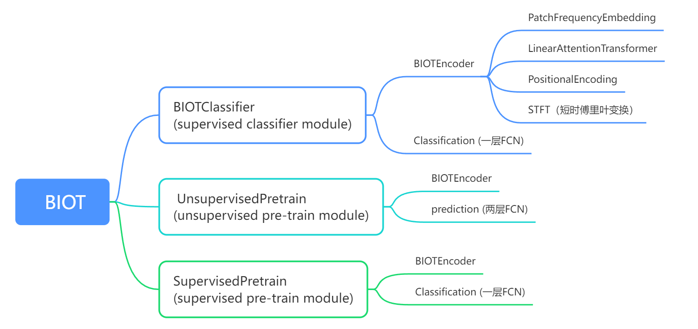
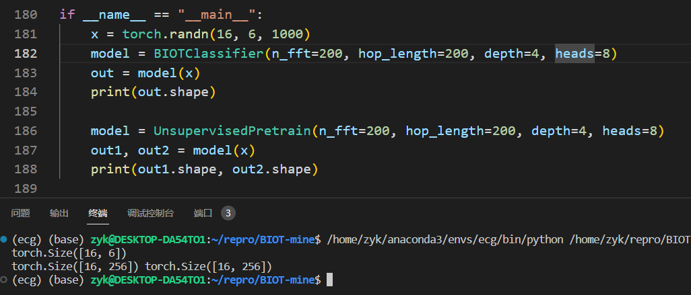
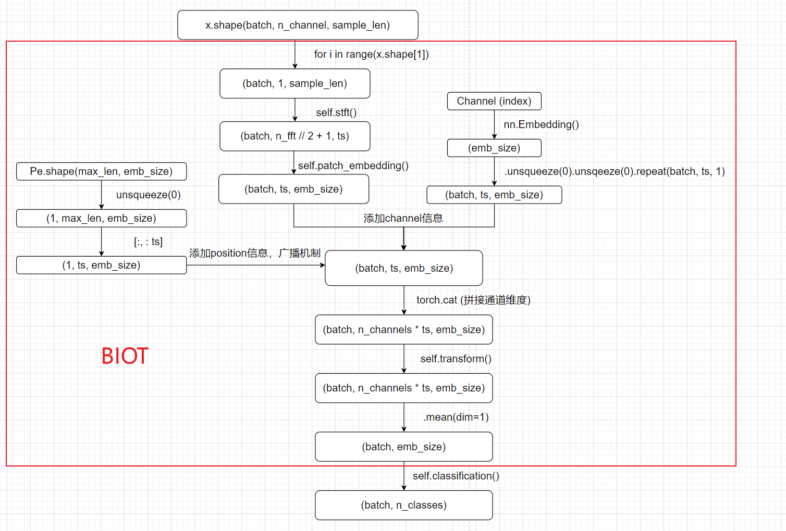

# BIOT代码模块讲解

**本文将从以下几个方面来讲解BIOT(bio-signal Transformer)的代码**

1. 网络模块是如何搭建的（画思维导图）？
2. 原始数据的输入格式是什么？
3. 如何处理数据不等长的问题？
4. 如何处理信号频率不一致的问题？
5. Dataloader过程怎么写的，输入到网络中的shape是什么？
6. Transformer的哪一步骤建立了时序关联性？
7. 对于无监督学习而言，正负样本对的构建形式是怎么样的？
8. 无监督学习的目标损失函数是什么？
9. 网络的性能评价指标是什么？

---

- BIOT网络的模块结构导图



可以看到几个基础模块分别为 `PatchFrequencyEmbedding` , `LinearAttentionTransformer`, `PositionalEncoding`, `Classification`和`prediction`

要关注的一些网络参数

1. `emb_size`：嵌入向量的维度，表示模型在内部使用的嵌入维度。
2. `n_freq`：频域的频率分量数量，通常与傅里叶变换的参数相关。
3. `n_classes`：任务中的类别数量，表示模型的输出类别数量。
4. `d_model`：模型的维度，通常表示模型内部处理的特征维度，例如注意力头的维度。
5. `max_len`：输入序列的最大长度，通常用于位置编码。
6. `heads`：多头自注意力机制中的头数，用于增加模型的表示能力。
7. `depth`：模型的深度，表示模型中堆叠的多头自注意力层的数量。
8. `n_fft`：傅里叶变换中的窗口大小，用于从时域转换到频域。
9. `hop_length`：傅里叶变换中窗口之间的跳跃长度，通常与信号的时间分辨率有关。

```python
class PatchFrequencyEmbedding(nn.Module):
    def __init__(self, emb_size=256, n_freq=101):
        super().__init__()
        self.projection = nn.Linear(n_freq, emb_size)
    
    def forward(self, x):
        """
            x: (batch, 1, n_freq, time)
            out: (batch, time, emb_size)
        """
        # (batch, 1, n_freq, time) -> (batch, n_freq, time) -> (batch, time, n_freq)
        x = x.squeeze(1).permute(0, 2, 1) 
        # (batch, time, n_freq) -> (batch, time, emb_size)
        output = self.projection(x)
        return output
```

```python
class ClassificationHead(nn.Module):
    def __init__(self, emb_size, n_classes):
        super().__init__()
        self.clshead = nn.Sequential(
            nn.ELU(),
            nn.Linear(emb_size, n_classes)
        )
    
    def forward(self, x):
        """
        	x: (batch, emb_size)
        	out: (batch, n_classes)
        """
        out = self.clshead(x)
        return out
```

```python
class PositionalEncoding(nn.Module):
    def __init__(self, d_model: int, dropout: float=0.1, max_len: int = 1000):
        super().__init__()
        self.dropout = nn.Dropout(dropout)
        pe = torch.zeros(max_len, d_model, dtype=torch.float)
        pe.requires_grad = False

        position = torch.arange(0, max_len, dtype=torch.float).unsqueeze(1) # (max_len, 1)
        div_term = torch.exp(torch.arange(0, d_model, 2).float() * -(math.log(10000.0) / d_model))

        pe[:, 0::2] = torch.sin(position * div_term)
        pe[:, 1::2] = torch.cos(position * div_term)

        pe = pe.unsqueeze(0) # (1, max_len, d_model)
        self.register_buffer('pe', pe)
    
    def forward(self, x):
        """
        	x: (batch, time, emb_size)
        	self.pe[:, :x.size(1)]: (1, time, emb_size)
        """
        x = x + self.pe[:, :x.size(1)]
        return self.dropout(x)
```

```python
class BIOTEncoder(nn.Module):
    def __init__(self, emb_size=256, heads=8, depth=4, n_channels=16, n_fft=200, hop_length=100, **kwargs):
        super().__init__()
        self.n_fft = n_fft # 傅里叶变换的窗口大小
        self.hop_length = hop_length # 窗口之间的跳跃长度

        self.patch_embedding = PatchFrequencyEmbedding(emb_size=emb_size, n_freq=n_fft // 2 + 1)
        self.transformer = LinearAttentionTransformer(
            dim = emb_size,
            heads = heads,
            depth = depth,
            max_seq_len = 1024,
            attn_layer_dropout = 0.2,
            attn_dropout = 0.2,
        )
        self.positional_encoding = PositionalEncoding(d_model=emb_size)

        # num_embeddings 表示要映射的类别或整数的总数，embedding_dim 表示每个嵌入向量的维度，将每个通道映射到一个256维的向量
        self.channel_tokens = nn.Embedding(num_embeddings=n_channels, embedding_dim=256) 
        # self.index是表示每个通道的索引，确保不同通道的顺序是固定的，以便在模型中正确处理每个通道的数据。
        self.index = nn.Parameter(torch.LongTensor(range(n_channels)), requires_grad=False)

    def stft(self, sample):
        # sample.shape: (batch, num_channels, time)
        spectral = torch.stft( # spectral.shape(batch, n_fft // 2 + 1, 10)
            input = sample.squeeze(1),
            n_fft = self.n_fft,
            hop_length = self.hop_length,
            center = False, # 窗口是否居中
            onesided = True, # 是否只保留单侧频谱
            return_complex = True, # 返回的是否是复数形式的频谱
        )
        return torch.abs(spectral) # (batch, n_fft // 2 + 1, 10)
    
    def forward(self, x, n_channel_offset=0, perturb=True): # n_channel: channel偏置
        """
            x: (batch, channel, time)
            output: (batch, emb_size)
        """
        emb_seq = []
        for i in range(x.shape[1]):
            channel_spec_emb = self.stft(x[:, i:i+1, :]) # 把每一个channel送入stft, 返回的shape为(batch, sample.shape[1], n_fft // 2 + 1, 10)
            channel_spec_emb = self.patch_embedding(channel_spec_emb) # (batch, time, emb_size)
            batch_size, ts, _ = channel_spec_emb.shape  
            # (batch, time, emb_size)
            channel_token_emb = self.channel_tokens(self.index[i + n_channel_offset]) # self.index[i+n_channel_offset] = i+n_channel_offset, self.channel_tokens把 i+n_channel_offset编码为256维向量
            channel_token_emb = (channel_token_emb).unsqueeze(0).unsqueeze(0).repeat(batch_size, ts, 1) 
            channel_emb = self.positional_encoding(channel_spec_emb + channel_token_emb) # STFT小波变换之后过patchembedding, 在加上通道位置数据，在加上位置编码

            if perturb:
                ts_new = np.random.randint(ts//2, ts)
                selected_ts = np.random.choice(range(ts), ts_new, replace=False)
                channel_emb = channel_emb[:, selected_ts]
            emb_seq.append(channel_emb) # 随机选取通道数，通道数的选择范围在[ts//2, ts]之间，相当于dropout
        
        # 不perturb的情况下，shape为(batch, channel * ts, emb_size)
        emb = torch.cat(emb_seq, dim=1)
        # (batch, channel * ts, emb_size) -> (batch, emb_size)
        emb = self.transformer(emb).mean(dim=1) 
        return emb
```

- 原始数据的输入格式是什么样子的？如何处理信号频率不一致的问题？（编码到相同的emb_size）

这三个问题是能够被同时解释的

原始数据的输入格式要看dataloader的 x 和 y 的shape

x.shape (batch_size, n_channels, sample_length) ，以CMB-MIT数据集为例，其DataSet建立过程是这样的，其中重采样和95%分位数缩放在`__getitem__`函数中

```python
class CHBMITLoader(torch.utils.data.Dataset):
    def __init__(self, root, files, sampling_rate=200):
        self.root = root
        self.files = files
        self.default_rate = 256
        self.sampling_rate = sampling_rate

    def __len__(self):
        return len(self.files)

    def __getitem__(self, index):
        sample = pickle.load(open(os.path.join(self.root, self.files[index]), "rb"))
        X = sample["X"]
        # 如果sampling_rate不等于default_rate的话，就在最后一个维度以10倍频率通过插值进行重采样
        if self.sampling_rate != self.default_rate:
            X = resample(X, 10 * self.sampling_rate, axis=-1)
        # 计算绝对值数据的 95% 分位数，并缩放X的值
        X = X / (
            np.quantile(np.abs(X), q=0.95, method="linear", axis=-1, keepdims=True)
            + 1e-8
        )
        Y = sample["y"]
        X = torch.FloatTensor(X)
        return X, Y
```

输入x的shape为(batch_size, n_channels, sample_length)，关键在于对于不同的n_channels和sample_length，最后经过`BIOTClassifier`和`UnsupervisedPretrain`，输出的shape是相同的，`BIOTClassifier`输出的shape是(batch_size, n_classes)，`UnsupervisedPretrain`输出的shape是两个(batch_size, emb_size)



输入的全过程



- 对于无监督学习而言，正负样本对的构建形式是怎么样的？

```python
# unsupervised pre-train module
class UnsupervisedPretrain(nn.Module):
    def __init__(self, emb_size=256, heads=8, depth=4, n_channels=18, **kwargs):
        super().__init__()
        self.biot = BIOTEncoder(emb_size=emb_size, heads=heads, depth=depth, n_channels=n_channels, **kwargs)
        self.prediction = nn.Sequential(
            nn.Linear(256, 256),
            nn.GELU(),
            nn.Linear(256, 256),
        )

    def forward(self, x, n_channel_offset=0):
        emb = self.biot(x, n_channel_offset, perturb=True)
        emb = self.prediction(emb)
        pred_emb = self.biot(x, n_channel_offset)
        return emb, pred_emb
```

在 `forward` 方法中，输入x的shape为(batch, n_channels, sample_len)，经过self.biot后输出的shape为(batch, emb_size)，如果 `perturb = True` ，就相当于在通道维度对x做dropout，之后过两个FC层，输出维度不变。所以正负样本对的构建就是一组数据直接过self.biot，另一组数据在过self.biot时随机dropout掉一些通道，在过两层全连接层。

- 无监督学习的目标损失函数是什么？

```python
prest_masked_emb, prest_samples_emb = self.model(prest_samples, 0)

# L2 normalize
prest_samples_emb = F.normalize(prest_samples_emb, dim=1, p=2)
prest_masked_emb = F.normalize(prest_masked_emb, dim=1, p=2)
N = prest_samples.shape[0]

# representation similarity matrix, NxN
logits = torch.mm(prest_samples_emb, prest_masked_emb.t()) / self.T
labels = torch.arange(N).to(logits.device) # 每一个样本的标签都不一样，来使得模型在Embedding空间中区分开各个样本
contrastive_loss += F.cross_entropy(logits, labels, reduction="mean")		
```

- 网络的性能评价指标是什么？

  要明确一点，无监督学习的过程本质上是在做特征提取，这一部分没有评价指标，只有将提取的特征应用到下游任务的时候，才会有相应的评价指标
