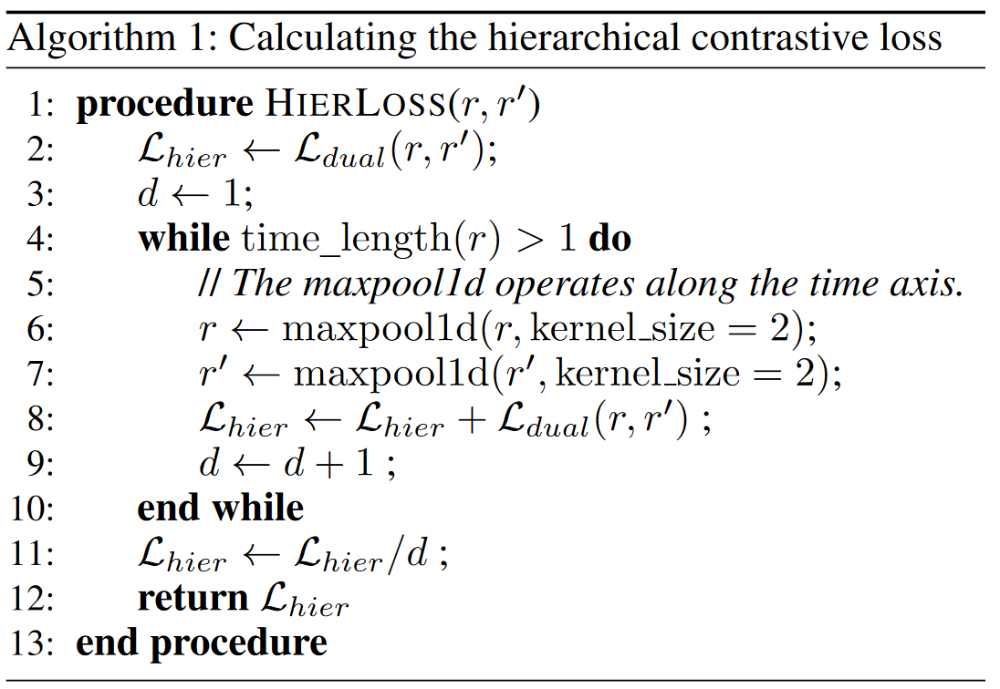

# TS2Vec

# Abstract

- 一种可以在任意的语义级别上学习时间序列特征的通用框架
- 通过数据增强后的上下文信息，来学得一种分层次的方法，可以赋予每一个时间戳一个鲁棒的上下文表征
- 测试的数据集：125 个 UCR 数据集和 29 个 UEA 数据集
- 测试任务：时序信号分类、时序预测、异常检测

# Introduction

### 其他研究不足

1. Instance-level 的表征对需要**细粒度**表征的任务（时序预测、异常检测）是**不合适**的

2. 现有的方法基本上**不能区分不同粒度**的多尺度上下文信息

   1. TNC[^1]是对段进行恒定长度的区分

   2. T-Loss[^2]使用原始时间序列中的随机子序列作为正样本。

      它们都没有对时间序列进行不同尺度的特征化，

3. 以捕获尺度不变信息现有的无监督学习方法很多都是受到 NLP 和 CV 领域的影响，从而引入了一些并**不适合于建模时序数据**的**归纳偏置**，比如变换不变性和裁剪不变性（时间序列的分布和语义可能会随着时间而变化，裁剪的子序列很可能与原始时间序列具有不同的分布）

### 本篇工作研究创新点

1. 在**实例级别**（instance-wise）和**时间维度**（temporal dimensions）上分层地区分正样本和负样本
2. 通过 max pooling 操作来获得任意的子序列，得到整体特征表示
3. 核心思想：对比目标是基于增强处理后的上下文信息，即**两个增强上下文中相同子序列**的表示应该保持一致

# Method

正样本对选取的原则：上下文一致性（将两个增强上下文中的相同时间戳的数据表示视为正样本对）

如何获得上下文一致的正样本对：时间戳掩码和随机裁剪

选用上下文一致性的原因：掩码和裁剪操作不会改变时间序列的幅度。其次，它们还通过迫使每个时间戳在不同的上下文中重新构建自己来提高了学习表示的鲁棒性。

----

对于示例个数为$N$ 的时间序列集合$\mathcal{X}=\{x_{1},x_{2},\cdots,x_{N}\}$，我们的目标是学习到一个非线性的特征提取函数$f_{\theta}$，可以将每一个$x_i$映射成$r_i$，输入$x_i$的维度是$T\times F$，$T$是序列长度，$F$是特征维度，即$x_i=\{x_{i,1},x_{i,2},\cdots,x_{i,T}\}$，其中$x_{i,t}\in\mathbb{R}^F$。经变换后得到$r_i=\{r_{i,1},r_{i,2},\cdots,r_{i,T}\}$ ，其中$r_{i,t}\in\mathbb{R}^K$ ，$K$是变换后的特征维度 $a$

编码器$f_\theta$由三部分组成：

1. 一个输入的映射层（全连接层），将时间戳为$t$的观测变量$x_{i,t}$映射到高维空间的隐变量$z_{i,t}$
2. 一个时间戳掩码和随机裁剪模块，对隐变量$z_i=\{z_{i,t}\}$进行掩码，以生成一个增强的上下文视图。其中掩码 $m\in\{0,1\}^T$，从采样概率$p=0.5$ 的伯努利分布中独立采样。对于任意的时间序列输入$x_i\in{\mathbb{R}}^{T\times F}$ ，TS2Vec 随机采样两个重叠的时间窗口$[a_1,b_1],[a_2,b_2]$，满足$[a_2,0<a_1\leq a_2\leq b_1\leq b_{2}\leq Tb_1]$，所以重叠段$[a_{2},b_{1}]$的上下文表示应该保持一致
3. 一个具有十个 residual blocks 的 dilated CNN（空洞卷积）模块，对于第$l$层的网络块来说，空洞参数是$2^{l}$

---

**计算分层次的对比损失函数**

为了得到更好的时序上下文表示，本文同时利用了**实例级别**（instance-wise）和**时间维度**（temporal dimensions）的对比损失来编码时间序列分布，融合后的损失函数应用于层次对比模型中的所有粒度级别

**时间维度的对比损失函数**：将来自输入时间序列两个视图的相同时间戳的表示视为正例，而来自相同时间序列不同时间戳的表示视为负例，$i$是输入的时间序列的索引，$t$是时间戳，$r_{i,t}$ 和$r_{i,t}^{\prime}$是来自$x_i$的两种不同增强的相同时间戳$t$的表示，时间维度的损失函数可以表示为

$$
\ell_{temp}^{(i,t)}=-\mathrm{log}\frac{\exp(r_{i,t}\cdot r_{i,t}^{\prime})}{\sum_{t^{\prime}\in\Omega}\left(\exp(r_{i,t}\cdot r_{i,t^{\prime}}^{\prime})+\mathbb{1}_{[t\neq t^{\prime}]}\exp(r_{i,t}\cdot r_{i,t^{\prime}})\right)} \tag{1}
$$

其中$\Omega$是两个子序列重叠的时间戳集合，$\mathbb{1}$是指示函数（indicator function），"Indicator function"（指示函数）通常用来表示一个条件是否成立。它是一个数学函数，通常用符号 1{condition}表示，其中"condition"是一个陈述性条件。当条件成立时，指示函数返回 1；否则，返回 0。

**实例级的对比损失函数**：$i$是输入的时间序列的索引，$t$是时间戳，实例级的损失函数可以表示为

$$
\ell_{inst}^{(i,t)}=-\log\frac{\exp(r_{i,t}\cdot r_{i,t}^{\prime})}{\sum_{j=1}^B\left(\exp(r_{i,t}\cdot r_{j,t}^{\prime})+1_{[i\neq j]}\exp(r_{i,t}\cdot r_{j,t})\right)} \tag{2}
$$

**总体的对比损失函数**：

$$
\mathcal{L}_{dual}=\frac1{NT}\sum_i\sum_t\left(\ell_{temp}^{(i,t)}+\ell_{inst}^{(i,t)}\right) \tag{3}
$$

$$
\ell_{inst}^{(i,t)}=-\log\frac{\exp(r_{i,t}\cdot r_{i,t}^{\prime})}{\sum_{j=1}^B\left(\exp(r_{i,t}\cdot r_{j,t}^{\prime})+1_{[i\neq j]}\exp(r_{i,t}\cdot r_{j,t})\right)} \tag{2}
$$

# 参考文献

[^1]: Tonekaboni, S.; Eytan, D.; and Goldenberg, A. 2021. Unsupervised Representation Learning for Time Series with Temporal Neighborhood Coding. In International Conference on Learning Representations.

[^2]: Franceschi, J.-Y.; Dieuleveut, A.; and Jaggi, M. 2019. Unsupervised Scalable Representation Learning for Multivariate Time Series. In Advances in Neural Information Processing Systems, volume 32. Curran Associates, Inc.